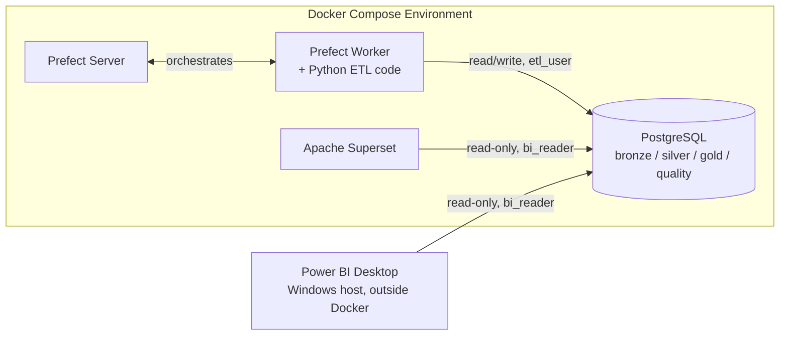
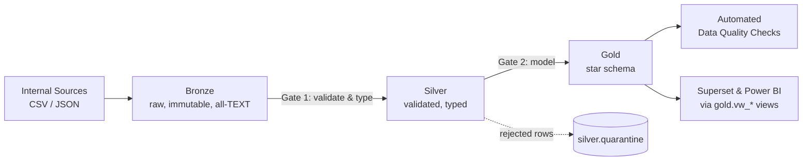
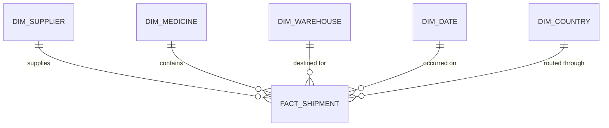
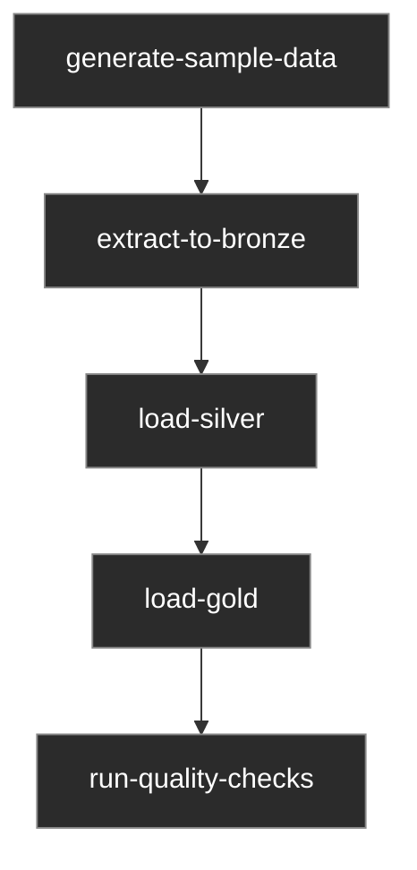
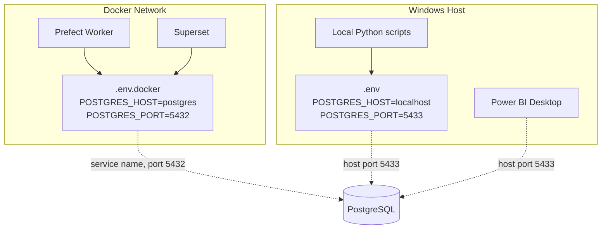

# Global Health Supply Chain Intelligence Platform

**An end-to-end, production-pattern data engineering platform** built to
simulate real-world supply chain analytics for global health medicine
distribution — designed and engineered the way a senior data engineering
team would build it for an organization like WHO, UNICEF, or the Global
Fund.

Raw supplier, shipment, and inventory data flows through a governed
**Bronze → Silver → Gold Medallion architecture** in PostgreSQL, is
validated against a documented rule catalogue with full quarantine
traceability, orchestrated on a **daily automated schedule via Prefect**,
monitored by a custom **Data Quality Framework**, fully **containerized
with Docker Compose**, and surfaced through dual BI reporting in
**Apache Superset and Power BI** — both reading identical, version-
controlled business logic.

Every architectural decision in this project is documented and
justified — not just implemented. See [`docs/`](./docs) for the full
Business Requirements Document, Architecture Guide, and an Operations
Guide built entirely from real incidents encountered and resolved
during development.

**Tech stack:** Python · PostgreSQL · Prefect · Docker & Docker Compose
· Apache Superset · Power BI · pytest

---

## What this platform does

Ingests supplier, medicine, purchase order, shipment, and warehouse
inventory data; validates and cleans it through a Bronze → Silver → Gold
Medallion pipeline; runs automated data quality checks; and serves the
results through Apache Superset and Power BI dashboards. The full pipeline
runs on a daily schedule via Prefect, entirely inside Docker.

---

## Architecture

### System Components



### Medallion Data Pipeline



### Gold Layer Star Schema



See `docs/02_architecture.md` for the full design rationale behind every
decision shown here.

### Pipeline Orchestration (Prefect)



One flow, five sequential tasks, each wrapping an independently-tested
module. Each task retries twice with a 10s delay on transient failure.
Scheduled daily at 02:00 UTC; see `docs/02_architecture.md` Section 5.

### Environment Configuration: Host vs. Container



Two separate env files exist because "localhost" means something
different depending on whether code runs on the host or inside a
container — a distinction that caused several real debugging sessions
during development. See `docs/04_operations_guide.md`.

## Prerequisites

- Docker Desktop (with WSL2 backend enabled, on Windows)
- Git Bash (Windows) or a standard bash-compatible terminal
- Python 3.11.9 (for local development outside Docker — see `.python-version`)
- Power BI Desktop (Windows only, optional — only needed for the Power BI
  report; not required to run the platform itself)

---

## Quick Start (recommended): full stack in Docker

This is the intended way to run the platform — one command, everything
containerized.

```bash
cd "/path/to/global-health-supply-chain-platform"
cp .env.docker.example .env.docker    # fill in real values before any real deployment
docker compose up -d --build
```

Give it 1–3 minutes on first run — Postgres initializes, Prefect server
runs its database migrations, and Superset runs its first-boot setup.

Check status:

```bash
docker compose ps
```

All four services (`postgres`, `prefect-server`, `prefect-worker`,
`superset`) should show `Up` / `healthy`.

**Access points (from your host machine's browser):**
- Prefect UI: http://localhost:4200
- Superset UI: http://localhost:8088 (login: `admin` / value of `SUPERSET_ADMIN_PASSWORD`)
- PostgreSQL (external tools, e.g. Power BI, a DB client): `localhost:5433`
  — **not 5432.** See "Known Local Environment Gotchas" below for why.

**Manually trigger a pipeline run** (it also runs automatically daily at
02:00 UTC per `prefect.docker.yaml`'s schedule):

```bash
docker compose exec prefect-worker prefect deployment run 'supply-chain-daily-pipeline/daily-pipeline-run'
```

Watch it execute:

```bash
docker compose logs -f prefect-worker
```

**Stop the stack** (preserves all data in named volumes):

```bash
docker compose down
```

---

## Known Local Environment Gotchas

Documented here because each of these cost real debugging time during
development — worth knowing up front rather than rediscovering them.

### Port 5432 may already be in use on Windows

Many Windows machines have a native PostgreSQL installation running as a
background service, which also listens on port 5432. This project's
Docker Compose file maps our containerized Postgres to **host port 5433**
specifically to avoid that collision (see `docker-compose.yml`'s `ports:`
comment). This means:

- **From your host machine** (a `psql` client, Power BI, a GUI DB tool):
  connect to `localhost:5433`.
- **From inside another container in this same Compose stack** (the
  Prefect worker, Superset): connect to `postgres:5432` — the internal
  container port is unaffected by the host remap; containers reach each
  other by Docker service name, not through the published host port at
  all.

If you ever see a `password authentication failed` or a connection
apparently succeeding against the wrong database, check
`netstat -ano | findstr :5432` (Git Bash) to see if something else is
already listening there.

### Git Bash mangles absolute container paths

Git Bash's MSYS layer automatically rewrites anything starting with `/`
into a Windows-style path, assuming you meant a path on the host. This
breaks commands like:

```bash
docker compose exec myservice ls /app/some/path
```

**Fix:** prefix the command with `MSYS_NO_PATHCONV=1` to disable this
translation for that one invocation:

```bash
MSYS_NO_PATHCONV=1 docker compose exec myservice ls /app/some/path
```

### Windows usernames with spaces need quoted paths

If your Windows username contains a space (e.g. `Daniel Njoroge`), always
quote paths in commands:

```bash
cd "/c/Users/Daniel Njoroge/Downloads/D/global-health-supply-chain-platform"
```

---

## Running the Prefect Server Standalone (local development, outside Docker)

Only needed if you're developing pipeline code locally and want to test
against a real Prefect server without the full Docker stack. The
Docker Compose setup above already includes its own Prefect server —
you do not need this if you're just running the platform normally.

**Terminal 1 — Prefect server:**
```bash
cd "/path/to/global-health-supply-chain-platform"
export PREFECT_HOME="$(pwd)/.prefect"
prefect server start
```

Leave this terminal open. Confirm it's running from another terminal:
```bash
curl http://localhost:4200/api/health
```
Should return `true`.

**Terminal 2 — Prefect worker:**
```bash
cd "/path/to/global-health-supply-chain-platform"
export PREFECT_API_URL="http://127.0.0.1:4200/api"
source .venv/Scripts/activate
prefect worker start --pool local-process-pool
```

**Terminal 3 — deploy / trigger manually / normal development:**
```bash
cd "/path/to/global-health-supply-chain-platform"
export PREFECT_API_URL="http://127.0.0.1:4200/api"
prefect deploy --all          # one-time, or after changing prefect.yaml
prefect deployment run 'supply-chain-daily-pipeline/daily-pipeline-run'
```

**Important:** `PREFECT_HOME` must be exported directly in each new
terminal before running the `prefect` CLI directly — unlike our Python
scripts (which load it automatically from `.env`), the bare `prefect`
CLI has no way to read `.env` on its own.

---

## Connecting BI Tools

Both Apache Superset and Power BI connect using the dedicated read-only
`bi_reader` PostgreSQL role (see `sql/schemas/09_readonly_role.sql`) —
never the main `etl_user` credential. This role can only `SELECT` from
the `gold` and `silver` schemas; it has no access to `bronze` and cannot
write anywhere.

**Superset** (already configured inside the Docker stack, via
`docker/superset-init.sh`): connect a new database in the Superset UI
using:

**Power BI Desktop** (runs on your Windows host, outside Docker):
- Get Data → PostgreSQL database
- Server: `localhost:5433` (not 5432 — see Gotchas above; not `postgres`
  — that hostname only resolves inside the Docker network)
- Database: `supply_chain_platform`
- Data Connectivity mode: Import
- Credentials: `bi_reader` / (value of `POSTGRES_READONLY_PASSWORD`)

Requires the Npgsql PostgreSQL driver (v4.0.10 specifically — newer
versions are not compatible with Power BI's connector mechanism)
installed separately on Windows first. See `docs/powerbi_setup.md`
(Phase 13) for full setup steps.

Both tools query the same `gold.vw_shipment_details`,
`gold.vw_supplier_performance`, and `gold.vw_medicine_expiry_risk` views
(see `sql/schemas/10_gold_views.sql`) — this is deliberate: identical
business logic, defined once, in version control, guarantees both tools
report identical numbers.

---

## Project Structure
---

## Development Setup (without Docker)

For working on pipeline code directly:

```bash
cd "/path/to/global-health-supply-chain-platform"
python -m venv .venv
source .venv/Scripts/activate
pip install -r requirements.txt
pytest tests/ -v
```

You'll also need a running Postgres instance — either the Docker
`postgres` service alone (`docker compose up -d postgres`, then connect
via `localhost:5433`), or your own local instance with the schema from
`sql/schemas/*.sql` applied in numeric order.

---

## Further Documentation

See `docs/` for:
- `01_business_requirements.md` — Business Requirements Document
- `silver_validation_rules.md` — Data quality rule catalogue (VR-01–VR-10)
- Architecture, deployment, and troubleshooting guides (Phase 13)